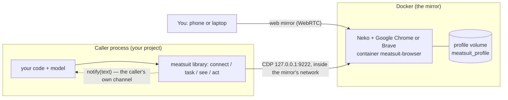

# How meatsuit works

meatsuit is **launching a browser, remembering its session, and eyes and hands** for someone else's code. It decides nothing: the caller (a bot project with its own model and its own credentials) looks at the page and chooses the next command. This page explains the parts and the reasons behind them. The API itself is in [04-contract.md](04-contract.md) (Russian); running the mirror is in [docker/README.md](../docker/README.md).

## The parts

- **The library** runs inside the caller's process (a container next to the mirror, or a laptop). It connects to the browser over CDP and gives the caller `task(site, fn)`; inside, `see()` returns the page as text plus numbered elements and `act(command)` performs one command from a closed set with human-paced mouse and keyboard.
- **The mirror** is Neko with one browser and one persistent profile. A person opens it from an ordinary web page, signs in to sites once, and solves whatever the bot stops on.
- **The profile** lives in a Docker volume (or a host folder), so sign-ins survive restarts and re-creates of the container.

## Credentials come from the caller

meatsuit holds no secrets of the callers and talks to nobody by itself:

| What | Where it comes from |
|---|---|
| site limits | the caller's `sites.json` (`connect({ sitesFile })`) or an object (`connect({ sites })`); the repository has only `sites.example.json` |
| notifications | `connect({ notify })`, an async function of the caller. `telegram.js` is a helper the caller may use; the token and chat are its arguments |
| state (queue lock, counters, journal) | `connect({ dir })`. **All callers of one browser use one `dir`**, otherwise two bots enter the browser at once |
| site passwords | never: a login page means `NeedsHuman`, and the person signs in through the mirror |

The core reads no environment variables (`test/api.test.js` checks it). Only the mirror has secrets of its own — the Neko passwords — and they live in the deploy file, outside git.

## One browser, many short tasks

`task()` queues behind a lock file in `dir` (works across processes), checks the site's limits, opens its own window, runs the caller's function under supervision and closes the window. A captcha, a login page, a block or a page off the task's site raises `NeedsHuman`: the task stops and **the window stays open** for the person. Budgets (`maxCommands`, `maxMinutes`) end runaway tasks. `dryRun` lets a caller rehearse on a live site: it sees everything and changes nothing.

The command set is closed (`click`, `fill`, `type`, `press`, `scroll`, `wait`, `back`, `goto`): no arbitrary JavaScript, and `goto` stays on the task's site. Clicks check that the target is really under the cursor before pressing; typing checks the focus.

## The deploy file and the config page

The mirror's settings — passwords, address and ports, browser and image tag, profile folder, time zone, CPU and memory ceilings — are one git-ignored file, `docker/.env` or the file `MEATSUIT_CONFIG` points to. Callers' settings are not there: the library runs in the caller's process and could not read a file on the server anyway.

- `npm run init` writes the file once (mode 0600, random hex passwords) and never overwrites it.
- `npm run config` is a temporary process on the host. It is deliberately not part of any container: the browser in the mirror opens arbitrary pages, so anything reachable from the browser's network could be attacked from a page. The config page listens on `127.0.0.1`, needs a one-time token sent in a header (no cookies), checks `Origin` and `Host`, never sends password values to the page, writes atomically with mode 0600, refuses with `409` if the file changed meanwhile, and exits when idle.
- `docker/up.sh` hands the file to `docker compose --env-file`.

## Choosing the browser

Google Chrome is the default because existing sign-ins were made in it; Brave is the alternative. They need different images, supervisord configs, policy paths and profile folders, so each has its own small compose file (`docker/browser-chrome.yml`, `docker/browser-brave.yml`) that the main `docker-compose.yml` extends according to `MEATSUIT_BROWSER`. Each browser has its own profile volume: a profile is not portable between them, and switching means signing in again.

The names other stacks depend on never change: the container `meatsuit-browser` (attach with `network_mode: "container:meatsuit-browser"`) and the Chrome profile volume `meatsuit_profile`. CDP listens only on `127.0.0.1` inside that network namespace and is never published.

## Leaks into git, closed systematically

`tools/secret-scan.sh` (no dependencies) runs before `npm test` and, optionally, as a pre-commit hook. It looks for typical keys and tokens, Neko passwords with a value, tailnet names and addresses, real ASNs, `ssh user@host` with a real host, and files that must not be tracked (deploy files, personal configs, archives). Personal words no pattern can know go into a git-ignored `.secret-scan.local`.

## Frozen: `extras/`

An earlier line of the project built an HTTP service (`GET /view`, `POST /act`) with its own queue and limits, a warm-up scheduler and an egress check. Nobody uses them now, so they moved to `extras/` with their own copies of the modules they need. They keep working and their tests run (`npm run test:extras`), but they are not developed, and the core loads nothing from them. Their documents: [http-api.md](http-api.md), [warmup.md](warmup.md), the egress check in [egress.md](egress.md#the-egress-check). In Docker they are the optional profiles `api` and `warmup`.

## What is verified

- Tested: the library in real headless Chromium on local pages; the deploy file, `init`, the config page in a real browser; `docker compose config` for both browsers, with and without Tailscale.
- Run for real with earlier versions: the library against a Neko mirror with Chrome for one caller project; the mirror with Brave on a desktop and once on a rented server.
- Running on a server since 8 October 2026: this compose file with Chrome and the Tailscale exit, `verify.sh` green, cookies and `localStorage` survive a restart and a re-create, one caller signed in and running `dryRun` tasks.
- Not yet: Brave with this compose file, the kill switch with the exit node off, a recorded row of the live check in [acceptance.md](acceptance.md). Open items: [ROADMAP.md](ROADMAP.md).
