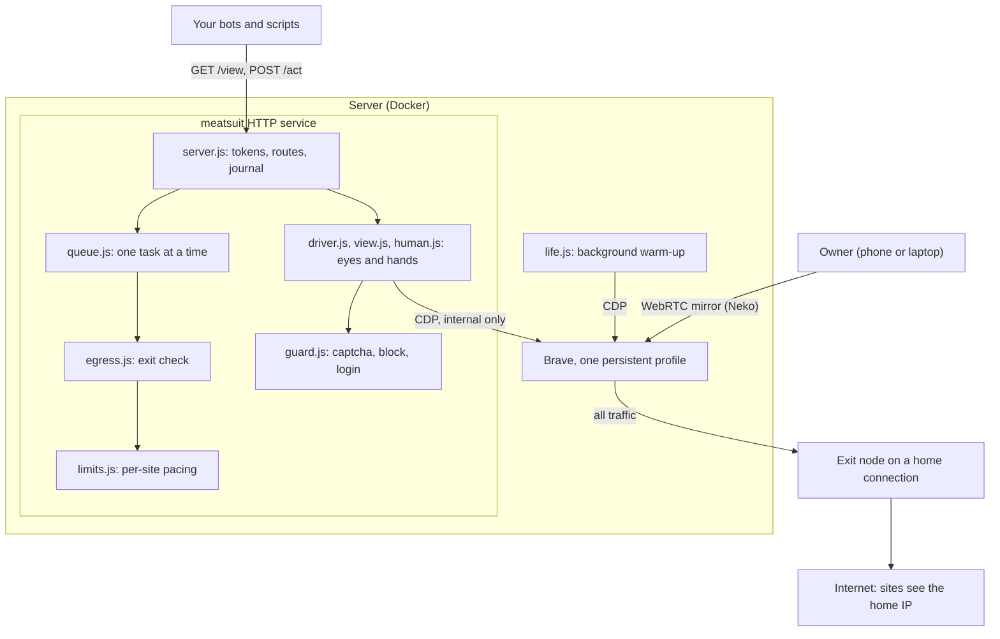

# How meatsuit works

meatsuit keeps **one long-lived, "warmed-up" browser** on a server. Its owner lives in it through a web mirror (browsing, logging in, watching videos). The owner's own bots and scripts drive the *same* browser through a small HTTP service that moves the mouse, scrolls and types the way a person does.

This page explains the idea, the parts, and the reasons behind the main decisions. To install and run it, see the [README](../README.md). For request and response details, see the [HTTP API](http-api.md). The original notes are in Russian and live in [`ru/`](ru/).

## Goals and non-goals

**For:** one person automating their *own* accounts at *low volume* (the design target is roughly 10 to 40 actions a day per site), from a browser that the same person also uses by hand.

**Not for:**

- Account farms, bulk actions, or anyone else's accounts.
- Solving captchas. On a captcha, a block page or a lost login, the service stops and asks the human.
- Spoofing fingerprints or geolocation. The browser is real and does not lie about itself.
- Autonomous agents that are handed a goal. The caller writes the steps. There is no model inside the service.

meatsuit does **not** claim to make automation undetectable, and it cannot promise your accounts will not be restricted. Platform terms still apply, and you are responsible for following them. The author read the terms of [Tinder](https://policies.tinder.com/terms/intl/en) and [LinkedIn](https://www.linkedin.com/help/linkedin/answer/a1341387): both prohibit automation, and neither publishes numeric limits for account behavior. Read the terms of every site before pointing a bot at it.

## The idea in plain words

Most browser-automation tools start a fresh, empty browser for every job. The site sees a visitor with no history, no cookies and often a datacenter address, and it sees that visitor again and again. Tools such as Browserless and Steel are built for exactly this: many disposable sessions.

meatsuit goes the other way. There is a single browser, and a real person really uses it. They log in once through the mirror, and the profile (cookies, history, sessions) lives in a Docker volume. Bots borrow the browser for short tasks, one at a time, each in its own window. All traffic leaves through the same home internet connection the owner uses anyway.

Three things follow from this:

- **Warm-up is mostly real life.** A script that pretends to browse is worse than a person browsing. A small background script ([warm-up](warmup.md)) fills days when the owner was away, but it is a supplement, not a replacement.
- **Browser handling lives in one place.** Hands, captcha handling, pacing and the IP check are in the service. A bot project only sends steps such as "click Apply".
- **Logins happen once.** The owner signs in through the mirror, and bots immediately use that session.

The belief behind all this is that a browser with real history is trusted more than a blank one. That is an **assumption**. The author found no source for it. It is cheap to act on, so the project does, but treat it as unproven.

## The parts

CDP is the Chrome DevTools Protocol, the interface Playwright-style tools use to control a browser. Here it is reachable only inside the container network and is never published.

### What each part does, and where the code is

| Part | What it does | Code |
|---|---|---|
| Browser mirror | Brave in a [Neko](https://github.com/m1k1o/neko) container. Picture and sound reach the owner over WebRTC, the profile persists in a volume, and the CDP port stays internal. | [`docker/`](../docker/README.md) |
| HTTP service | Three routes (`GET /view`, `POST /act`, `GET /`), bearer tokens, per-client site lists, a journal. | [`server.js`](../server.js) |
| Driver | Attaches to the running browser with [Patchright](https://github.com/Kaliiiiiiiiii-Vinyzu/patchright) over CDP, opens one window per task, runs actions. | [`driver.js`](../driver.js) |
| Eyes | Builds the "visible HTML" copy of a page with numbers on clickable things. Finds targets by number, text or CSS. | [`view.js`](../view.js) |
| Hands | Mouse curves, wheel scrolling, typing with typos. They are computed as pure "plans" and then replayed on the page. | [`human.js`](../human.js), [`human/`](../human/) |
| Guard | Recognises a captcha, a block page or a login page from a snapshot of the page. | [`guard.js`](../guard.js) |
| Queue | One task at a time, tickets for waiters, idle timeout. | [`queue.js`](../queue.js) |
| Limits | Per-site pacing that behaves like a person (see below). | [`limits.js`](../limits.js), [`profiles/sites.json`](../profiles/sites.json) |
| Egress check | Confirms the traffic really leaves from the expected country and provider. | [`egress.js`](../egress.js), [egress notes](egress.md) |
| Notifier | Telegram message when a human is needed. | [`notify.js`](../notify.js) |
| Warm-up | Separate command that reads ordinary sites at random hours. | [`life.js`](../life.js), [`life/`](../life/), [notes](warmup.md) |

State on disk: `data/journal.jsonl` and `data/limits.json` (service), `data/life.json`, `data/life.jsonl` and `data/persona.json` (warm-up), and the browser profile in a Docker volume. Tokens are in `profiles/clients.json`, which is git-ignored.

### One task, start to finish

1. A bot sends `begin` with a site name. The service checks the request and the client's rights (400, 401, 403), then joins the queue.
2. When it is the bot's turn, the service checks the exit address (503 on failure) and the site's pacing limit (429 on failure).
3. The service opens a **new browser window** and returns a task id. The owner's tabs are not touched.
4. The bot sends actions (`goto`, `click`, `fill`, ...) and reads `GET /view`. After every action the guard looks at the page. A captcha, block or login page returns `409 needs_human`.
5. `end` closes the window. A task that is left alone for 5 minutes is closed automatically.

Exact fields and codes are in the [HTTP API](http-api.md).

## Design decisions

**One browser, shared with the human.** A person actually living in the browser is the best warm-up there is, and sites already know the owner is one person. Per-project browser profiles would each need their own warm-up, logins and upkeep.

**A real browser, no spoofing.** A real browser is consistent with itself. Faked fingerprints or geolocation create mismatches, for example with the IP address. The project also does not need to pretend to be something else, because the owner genuinely uses this browser.

**HTTP instead of a library.** Bot projects live in different containers and languages. One service they can all reach (even with `curl`) keeps the queue, limits, hands, captcha handling and IP check in one place.

**Patchright over CDP, behind a `Driver` interface.** Patchright is a Playwright fork with the same API that avoids some of the DevTools-protocol traces plain Playwright leaves. Everything that touches the browser goes through [`driver.js`](../driver.js), so another driver can replace it if CDP starts getting flagged. OS-level input would share one cursor with the owner, which is why CDP comes first. Not verified: whether Patchright's patches still apply when it *attaches* to a running browser instead of launching it. That was not tested against detector sites.

**A window per task.** Creating a page through CDP normally opens a tab inside an existing window, which would be the owner's. The driver asks the browser for a new window instead, so the bot never touches the owner's tabs and the owner can watch the bot work in the mirror.

**Captcha means stop, not bypass.** Bypassing is an arms race and a quick road to a ban. The service returns `409 needs_human`, keeps the window open, sends a Telegram message if configured, and refuses further actions until the owner solves the problem in the mirror and the caller sends `resume`. The site is also paused for a few days (default 3).

**Egress through a home IP, and no network instead of a fallback.** A site sees the address of the real connection, so an IP cannot be faked. One benchmark the author relied on ([source](https://ianlpaterson.com/blog/anti-detect-browser-benchmark-patchright-nodriver-curl-cffi/)) says that at tens of actions a day, the tells are the control protocol, a datacenter IP, and non-human behaviour on forms protected by reCAPTCHA, not volume. The author has not independently verified that. A server in a datacenter would show a datacenter IP on every request, including the owner's normal browsing. So the browser's traffic goes through an **exit node**: a home device that [Tailscale](https://tailscale.com) (a mesh VPN) lets other devices use as their way out to the internet. If the tunnel is down, the browser has no network at all rather than leaving from the server's address. The service also asks an echo service which country and provider it appears to come from, and refuses work if that is not what you configured. Trade-off: if a site starts flagging that home address, it affects the owner's normal use too. See [egress](egress.md).

**One task at a time.** There is one browser and one set of hands, and two simultaneous tasks would look like two people sharing a device. Waiters get a ticket and keep their place. An idle timeout stops a crashed bot from blocking the queue forever.

**Limits that behave like a person.** No platform publishes numeric behaviour thresholds, so a flat cap is a guess in any case. Each site gets a daily and hourly budget, working hours, a ramp-up from a small share of the daily budget, random rest days, day-to-day jitter, and a pause after a challenge. All the numbers are the author's untested starting values.

**Eyes without a model.** `GET /view` returns a cleaned copy of what is visible, with numbers on interactive elements that are actually on top (a button under a modal gets no number). The copy is built inside Patchright's isolated JavaScript world, so the page's own DOM is never modified and the page cannot see the numbers. The caller, a script or its own language model, decides what to click.

**Neko, not noVNC.** Neko streams over WebRTC, so video plays smoothly with sound. A person can actually watch a film in it.

## Prior art and why this niche

[Patchright](https://github.com/Kaliiiiiiiiii-Vinyzu/patchright) is the base for driving the browser. [Neko](https://github.com/m1k1o/neko) provides a remote browser with a mirror. The mouse model borrows the idea of [ghost-cursor](https://github.com/Xetera/ghost-cursor) (Bézier curves and Fitts's law), written as a small module here instead of a dependency. The idea from [Stagehand](https://stagehand.dev) (find a button by description when text or a selector fails) may come later and is not built. Browserless and Steel serve many disposable sessions, and autonomous agents such as Browser Use route every step through a model, which is expensive and unpredictable. nodriver (Python, AGPL) and Camoufox (a Firefox build) were set aside because of language, licence and engine, and because a Brave profile cannot move to them. The author found nothing that combines "a person lives in this browser" with "bots work in it politely, in turns". That gap is the niche. This is a short survey by one person, not a complete review ([Russian notes](ru/01-analysis.md)).

## Status

"Verified" means automated tests pass (376 tests in `test/`; the whole suite passed in the author's last full run, including the ones that drive a real Chromium) and, for the browser parts, a run against local test pages (`npm run test:e2e`). It does not mean tested on real sites.

| State | Part | Basis or caveat |
|---|---|---|
| Built and verified | Hands (mouse, scroll, typing) | Unit tests on the plans. On Chromium: Cyrillic and capital letters land exactly, events are trusted, an off-screen click scrolls by wheel notches |
| Built and verified | Eyes and driver | Tests drive real Chromium on fixture pages. A live run of the whole service on a local test page covered window per task, targets by number, text and CSS, and the 403, 409, 410 and 422 paths |
| Built and verified | HTTP service, queue, limits, egress check, notifier | Tests use a stub driver, a virtual clock and an injected network. No real exit node or Telegram bot is in the loop |
| Built and verified | Guard | Unit tests on sample page snapshots. It checks a visible captcha frame, the title, the address and the text of short pages. Known gaps: Arkose and a few other captcha frames are caught only by text or address, and the check runs after each action, not continuously |
| Built and verified | Mirror (Neko and Brave in Docker) | Locally: it starts, the CDP port answers, the mirror shows live Brave, and the profile survives stop and recreate |
| Built, not verified | Driving Brave | Attaching Patchright to Brave to read tabs and cookies works ([`docker/verify.sh`](../docker/verify.sh)). Windows, clicks and typing were run on Chromium only |
| Built, not verified | Patchright patches under `connectOverCDP`; detector sites; real sites | Nothing recorded |
| Built, not verified | Exit-node stack (Tailscale container, kill switch, [compose file](../docker/docker-compose.egress.yml)) | The compose file validates. It was never run end to end. WebRTC and DNS through the tunnel are untested |
| Built, not verified | Mirror from a real keyboard, and over a tailnet address | Only synthetic input was tried |
| Built, not verified | Warm-up on a multi-day schedule | Logic is tested on a virtual clock. No long live run. Not tried on Brave or real sites |
| Built, not verified | Telegram messages | Tests use a local fake server. No live bot run is recorded |
| Built, not verified | Pacing numbers | Untested starting values |
| Built, not verified | The HTTP service as a Docker service | Compose has a `server` service (profile `api`) that `docker compose config` accepts; it has not been started in a container |
| Not built | Warm-up that cooperates | It does not queue behind bot tasks, does not detect that the owner is in the mirror, uses a tab in the first window instead of its own window, and sends no Telegram message |
| Not built | `paste` action | Long texts are typed key by key |
| Not built | Model-assisted button finding | An idea only |
| Not built | Softer handling of brief network outages | Today any failed exit check closes the running task |
| Not built | Translations | The status page, Telegram texts and the `message` field of errors are in Russian |
